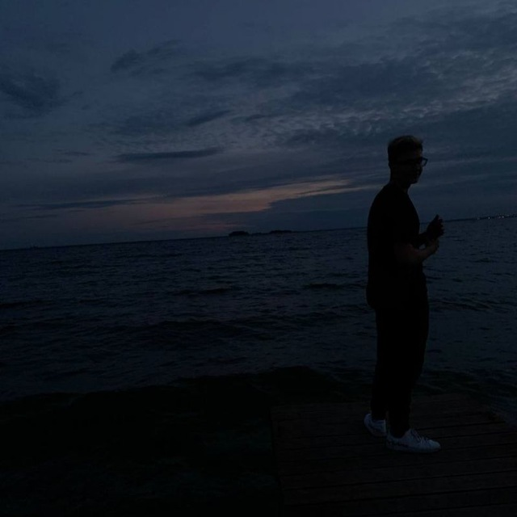

   # О себе
    Обучаюсь программированию на курсах Нетология, паралельно учусь в Новосибирском Государственном Техническом Университете на инженера, факультет Автоматики и вычислительной техники.
   

   Привет! Меня зовут [Артемий], я занимаюсь программированием и люблю создавать интересные проекты.

   ## Интересы

   - Программирование
   - Чтение книг
   - Путешествия

   ### Контакты

   - [GitHub](https://github.com/Yuorf)
 